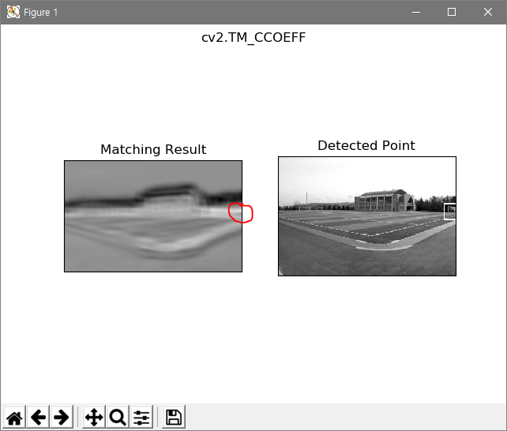
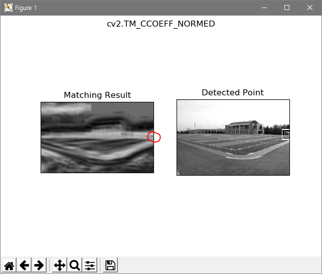
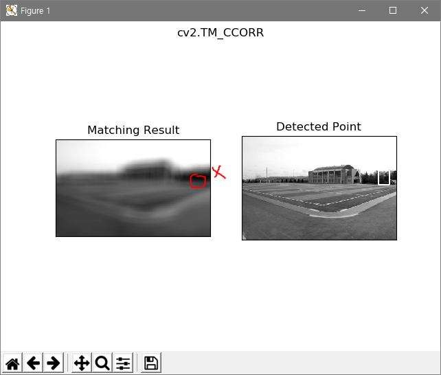
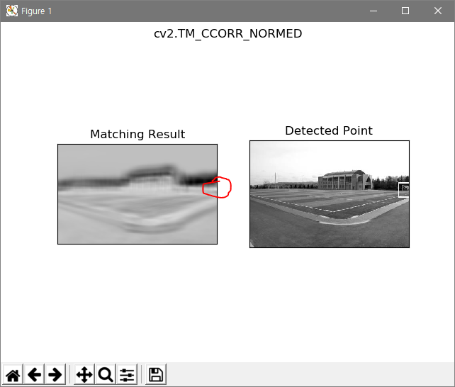

# Template-Matching
Template Matching using in python

# Overview
Template Matching is a method for searching and finding the location of a template image in a larger image.
I set the goalpost of the playground as a template and started to analyze it.

# Result
## template & target images

## result

This result is misinterpreted.

